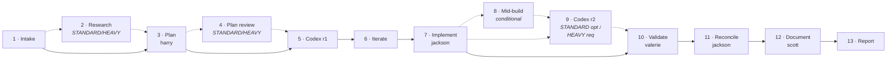

# mozart-orchestration

*A Claude Code plugin that turns one request into an orchestrated, narrated, multi-agent pipeline.*


## Why this exists

One-shot Claude Code requests either over-fire (one giant context doing everything) or under-deliver (no review, no plan, no validation). Mozart threads the needle: you describe what you want, and he routes it through a real delivery pipeline — research, plan, specialist review, implement, verify, document — using named subagents running in their own contexts. Each stage has a defined scope and a clear handoff. You see every move as it happens.

Mozart handles three shapes of work: **DELIVER** (build or change something), **AUDIT** (review against a goal), and **DIAGNOSE** (investigate a failure). He tiers tasks — TINY / STANDARD / HEAVY — to right-size the gates, classifies project context (GREENFIELD / BROWNFIELD) to decide when duplicate-check agents run, and narrates every Task spawn so you always know who is working and why.

## Quickstart

Install from the Claude Code plugin marketplace:

```
/plugin marketplace add jstuart0/mozart-orchestration
/plugin install mozart-orchestration
```

Then invoke mozart with your request:

```
/mozart <your request>
```

Example invocations:

- `/mozart add OAuth login to the admin panel` — DELIVER, STANDARD tier
- `/mozart audit our auth middleware` — AUDIT shape
- `/mozart investigate why pgvector queries are slow on staging` — DIAGNOSE shape
- `/mozart resume thoughts/shared/plans/<slug>.state.md` — resume a stopped campaign

Without an argument, mozart asks what to orchestrate.

## The pipeline at a glance



Solid edges (`-->`) run on every tier. Dashed edges (`-.->`) mark conditional stages: Research runs on STANDARD/HEAVY; Plan review fan-out runs on STANDARD/HEAVY; Mid-build specialists trigger per-phase when conditions match; Codex r2 is optional on STANDARD and mandatory on HEAVY.

*AUDIT and DIAGNOSE flows are shorter — see [PIPELINE.md](agents/PIPELINE.md) for the full reference.*

## Three orchestration shapes

| Shape | When | Output |
|---|---|---|
| **DELIVER** | "build X", "ship Y", "fix Z" | Working code, verified against the plan, documented |
| **AUDIT** | "review X", "audit Y for Z" | Findings document; optional remediation flow |
| **DIAGNOSE** | "why is X broken?", "investigate Y" | Findings document with symptom / repro / root cause / remediation options |

Bug-shaped DELIVER on STANDARD/HEAVY auto-promotes to DIAGNOSE first.

## Task tiers

| Tier | What it adjusts |
|---|---|
| **TINY** | Skip research, plan-review fan-out, mid-build specialists. Brief jackson directly → verify → commit |
| **STANDARD** | Default — full DELIVER pipeline |
| **HEAVY** | STANDARD + mandatory ian on every phase + mandatory xander mid-build + mandatory codex r2 on the final diff |

Mozart classifies tier at intake based on surface area (auth, schema, migrations, infra, security-critical → HEAVY).

## Project context

| Context | What it controls |
|---|---|
| **GREENFIELD** | Skip librarian. Nothing meaningful to search against. |
| **BROWNFIELD** | Librarian runs at plan review and mid-build for new functions, classes, and services |

When in doubt, mozart classifies BROWNFIELD; librarian short-circuits if the work turns out to be greenfield-shaped in practice.

## What's in the box

```
mozart-orchestration/
├── .claude-plugin/
│   ├── marketplace.json
│   └── plugin.json
├── agents/
│   ├── LEARNINGS.md             # cross-project field notes (append-only)
│   ├── PIPELINE.md              # full pipeline reference
│   ├── bob.md
│   ├── codebase-analyzer.md
│   ├── codebase-locator.md
│   ├── codebase-pattern-finder.md
│   ├── dexter.md
│   ├── dick.md
│   ├── harry.md
│   ├── ian.md
│   ├── jackson.md
│   ├── librarian.md
│   ├── mozart.md                # the conductor
│   ├── otto.md
│   ├── ruby.md
│   ├── sarah.md
│   ├── scott.md
│   ├── valerie.md
│   ├── web-search-researcher.md
│   └── xander.md
├── commands/
│   └── mozart.md                # the /mozart slash command
├── docs/                        # created in v0.1.0 release
│   └── README.md
├── .github/                     # created in v0.1.0 release
│   ├── ISSUE_TEMPLATE/
│   └── workflows/
├── CHANGELOG.md
├── CODE_OF_CONDUCT.md
├── CONTRIBUTING.md
├── INTEGRATION.md               # ticketing + docs configuration
├── LICENSE
├── README.md
└── SECURITY.md
```

`thoughts/` (gitignored) — per-campaign state files, plans, flow sketches, and investigation notes. Never committed.

## Live narration

Mozart announces every Task invocation before it starts (one line) and summarizes every return when it comes back (one line), each prefixed `TASK [<stage>]` for scannability. You always know which agent is running, on which campaign, and why.

## Integration

Mozart is pluggable for two surfaces that vary by team:

1. **Ticketing** — Plane, Linear, Jira, GitHub Issues, or none.
2. **Documentation surfaces** — GitHub wiki, in-repo docs, an external wiki (Wiki.js, Notion, Confluence), or a custom mix.

Configure both by adding stanzas to your repo's `CLAUDE.md`. See [`INTEGRATION.md`](./INTEGRATION.md) for templates and the contract mozart follows.

If you don't configure ticketing, mozart skips ticket steps entirely — research, planning, implementation, and verification still work. If you don't configure docs, scott will publish to in-repo `README.md` / `CHANGELOG.md` / `docs/` only.

## Optional: codex CLI

Mozart's pipeline calls an external `codex` CLI at stages 5 (codex-r1-plan, plan review) and 9 (codex-r2-diff, diff review) for fresh-context, second-opinion review. The value is that codex runs with no plan-iteration history, which surfaces issues that in-context agents sometimes miss. The plugin works without codex — those stages skip with a logged note and the pipeline continues.

If you want codex's input, install it from <https://github.com/openai/codex>. On HEAVY tier, codex r2 is mandatory; on STANDARD it's optional; TINY skips both rounds entirely.

## Authority

The mozart agent persona (`agents/mozart.md`) is authoritative for orchestration behavior. The `/mozart` slash command is a thin wrapper that hands control to the persona at the top level of a session.

See [CONTRIBUTING.md](./CONTRIBUTING.md) for the persona-authoring contract and instructions for adding new agents.

## License

MIT — see [LICENSE](./LICENSE).
