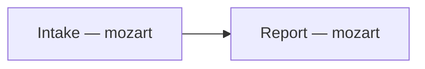
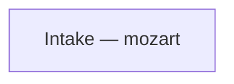

# Pipeline flow: <slug>

| Field | Value |
|---|---|
| Run started | <ISO timestamp> |
| Run completed | <ISO timestamp or "in progress"> |
| Shape | DELIVER | AUDIT | DIAGNOSE |
| Tier | TINY | STANDARD | HEAVY |
| Flow | FULL | PLAN-ONLY | RESEARCH-ONLY | INVESTIGATE-ONLY | AUDIT-ONLY | VALIDATE-ONLY |
| Mode | AUTONOMOUS | LOOP-IN |
| Context | GREENFIELD | BROWNFIELD |
| ticket | <id and url, or n/a> |
| Plan | .mozart/plans/<slug>.md |
| Investigation | .mozart/investigations/<slug>.md (or n/a) |

## Proposed flow (locked at intake)

**Rationale**: <tier, flow shape, context, the conditional specialists you anticipated and why, and the 2b trigger outcome>

## Actual flow (live)

## Deviations from proposed

- <none yet, or: **Stage N** — what changed. **Triggered by**: the concrete reason>

## Stage trace

- **<HH:MM:SS>** — Stage 1 (Intake): <outcome>

## Agent participation summary

| Agent | Role this run | Invocations | Outcome |
|---|---|---|---|
| <agent> | <role> | <count> | <outcome> |

## Skipped agents (and why)

- **<agent>**: <why it did not run>

## Notes

<anything noteworthy about the flow itself, or none>
